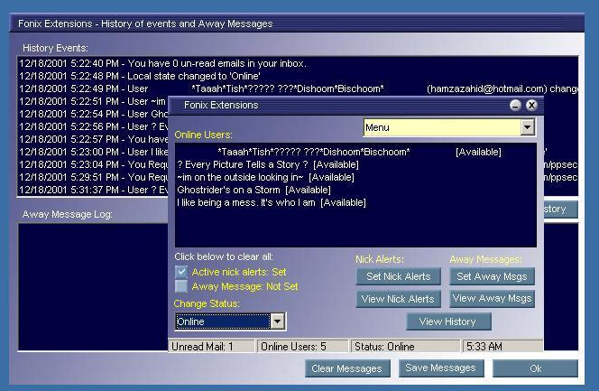



## \_A MSN messenger BOT \- Fonix\_

### Description

This is a fully activated MSN (Microsoft Messenger) Bot! You can set personalized away messages - different msgs for different people or a single away message for all... others can beep you, like in ICQ, they can remotely, if authorized, change your nick name, set you away, back or even other stuff - fully extensible! They can ask the bot for jokes and even when you're not there.. your BOT has it all under control, providing entertainment and letting people know u're away :D Please vote! I have put ALOT of effort into this one! Thanks

----

1th May, 2002: Version 2.8 Released.

This little beauty can extend MSN Messenger's functionalities. It lets you set away messages, different for different people, or one message for all. It keeps log of away messages while you'r gone, keeps a history log which tells you everything from what time you logged on to the time you log off, including everything - the time your mates logged on, logged off, messaged, anything that ever happens.. so if you're away for a while, you won't be missing out on much! This also lets people BEEP you when you're not responding, lets you control your MSN from elsewhere, set yourself away, back, check your online user list from anywhere in the world as long as your MSN's switched on with Fonix taking control at your work place. It also provides entertainment - people can ask for jokes from your bot, while you'r online, away or out someplace shopping for christmas. The new version includes Sound Alerts on nicknames and auto startup with MSN Messenger. It also remembers your last status so if u ever log off while u're not at the desk, it'll log u back in with the last status u had, for example if u were invisible before disconnecting, you'll log in again as being invisible :o) There's 'a LOT' more! Below is a preview of version 2.8 available for download at:

http://www.download.com (Search for "msn bot")
 
### More Info
 

             |
---                |---
**Submitted On**   |2001-10-21 07:44:18
**By**             |[Syed Fahad Gilani](https://github.com/Planet-Source-Code/PSCIndex/blob/master/ByAuthor/syed-fahad-gilani.md)
**Level**          |Advanced
**User Rating**    |4.9 (163 globes from 33 users)
**Compatibility**  |VB 6\.0
**Category**       |[Complete Applications](https://github.com/Planet-Source-Code/PSCIndex/blob/master/ByCategory/complete-applications__1-27.md)
**World**          |[Visual Basic](https://github.com/Planet-Source-Code/PSCIndex/blob/master/ByWorld/visual-basic.md)
**Archive File**   |[\_A MSN mes3014410202001\.zip](https://github.com/Planet-Source-Code/syed-fahad-gilani-a-msn-messenger-bot-fonix__1-28094/archive/master.zip)

